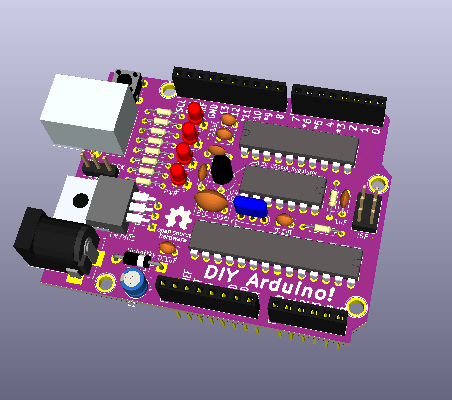

DIY Arduino clone done in KiCad.

 

You will need to build a FTDI breakout board using a FT231XQ QFN20 chip with a pinout matching the FT231XS (SSOP-20), but in a DIP-20 spacing.  It is all downhill from there!

Bill Of Materials
----------------
- 1 ea., DIY Arduino PCB from kicad.pcb file.
- 1 ea., FT231x breakout PCB from kicad.pcb file.
- 1 ea., U1 L7805CV IC REG LINEAR 5V 1.5A TO220AB, https://www.digikey.com/short/jn9qzp
- 1 ea., U2 FT231XQ 20QFN, https://www.digikey.com/short/jn57wn
- 1 ea., U3 SN74LS125AN, IC BUF NON-INVERT 5.25V 14DIP, https://www.digikey.com/short/jn973j
- 1 ea., U4 MCP1700-3302E/TO IC REG LINEAR 3.3V 250MA TO92-3, https://www.digikey.com/short/jn9q57
- 1 ea., U5 Atmega328P-PU https://www.digikey.com/short/jn57wj
- 1 ea., Y1 CER RES 16.0000MHZ 30PF T/H, ECS ZTT-16.00MX, https://www.digikey.com/short/jn9pjv
- 1 ea., C1 0.33uF 50V electrolytic Capacitor 2.5mm lead spacing, Nichicon 	UMT1HR33MDD1TP, https://www.digikey.com/short/jddb2h
- 4 ea., C2 - 5 CAP CER 0.1UF 25V Y5V RADIAL 2.5mm lead spacing, Vishay K104Z15Y5VE5TL2, https://www.digikey.com/short/jn9pm2
- 3 ea., C6 - 8 CAP CER 1UF 25V X7R RADIAL 5mm lead spacing, TDK FG28X7R1E105KRT06, https://www.digikey.com/short/jn9p97
- 1 ea., R1 4K7 Ohm Resistors 1/4 W 5%, https://www.digikey.com/short/jn5tmq
- 2 ea., R2, R13 1K Ohm Resistors 1/4 W 5%, https://www.digikey.com/short/jn5t4d
- 2 ea., R3 - 4 470 Ohm Resistors 1/4 W 5%, https://www.digikey.com/short/jn5tmp
- 2 ea., R5 - 6 22 Ohm Resistors 1/4 W 5%, https://www.digikey.com/short/jd0wcj
- 2 ea., R7 - 8 10K Resistors 1/4 W 5%, https://www.digikey.com/short/jn5t41
- 1 ea., D1 DIODE SCHOTTKY 40V 2A DO15, SMC SB240TA, https://www.digikey.com/short/jn57cv
- 1 ea., D2 (Power) Green 3mm LED 5.6mcd, LiteOn LTL-4231N https://www.digikey.com/short/jn5tr0
- 1 ea., D13 (D13) Red 3mm LED 4.4mcd, LiteOn LTL-4211N, https://www.digikey.com/short/jn5trr
- 2 ea., D3, D4 (TX/RX) Yellow 3mm LED 6.7mcd, LiteOn LTL-4251, https://www.digikey.com/short/jn5t5f
- 1 ea., F1 PTC RESET FUSE 30V 700MA RADIAL, Littlefuse RHEF070-2, https://www.digikey.com/short/jddbbh
- 1 ea., J1 USB B Connector, Pulse E8144-B02022-L, https://www.digikey.com/short/jn571j
- 1 ea., J2 Barrel Jack 2.1mm, CUI 	PJ-202AH https://www.digikey.com/short/jd0wz3
- 2 ea., P1, P3 8-Pin header, https://www.digikey.com/short/jwj4dp
- 1 ea., P2 6-Pin header, https://www.digikey.com/short/jwj4w4
- 1 ea., P3 10-Pin header, https://www.digikey.com/short/jwj4n7
- 4 ea., Rubber feet, https://www.digikey.com/short/jntvm1 or https://www.digikey.com/short/jntvbz
- 1 ea., Pinheader, S1012EC-40-ND, https://www.digikey.com/short/7382z2
- 1 ea., CONN JUMPER SHORTING .100" GOLD, Sullins NPC02SXON-RC, https://www.digikey.com/short/jn5t0j
- 1 ea., 28 Pin socket, On Shore ED281DT, https://www.digikey.com/short/jn5tz5
- 1 ea., 20 Pin socket, On Shore ED20DT, https://www.digikey.com/short/jn5tzm
- 1 ea., 14 Pin socket, On Shore ED14DT, https://www.digikey.com/short/jn5tp1

License
----------------
[Attribution-ShareAlike 3.0 United States (CC BY-SA 3.0 US)](https://creativecommons.org/licenses/by-sa/3.0/us/)

You are free to:

- Share — copy and redistribute the material in any medium or format
- Adapt — remix, transform, and build upon the material

Under the following terms:

- Attribution — You must give appropriate credit, provide a link to the license, and indicate if changes were made. You may do so in any reasonable manner, but not in any way that suggests the licensor endorses you or your use.
- ShareAlike — If you remix, transform, or build upon the material, you must distribute your contributions under the same license as the original.