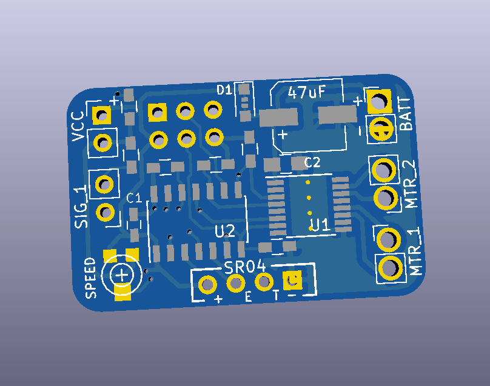

Attiny H-Bridge

 

Bill Of Materials
----------------
  
- 1 ea., Perfect Purple PCB from OSH Park, with not so perfect layout from [project.kicad_pcb](project.kicad_pcb) file.
- 1 ea., ATTINY84A, https://www.digikey.com/short/z8dt12
- 1 ea., TC78H651FNG IC MOTOR DRIVER 16TSSOP, https://www.digikey.com/short/z8r9nr
- 2 ea., TRIMMER 10K OHM 0.1W J LEAD TOP, https://www.digikey.com/short/zq5dpc
- 1 ea., CAP CER 0.1UF 16V X7R 0603, https://www.digikey.com/short/z8dz80
- 1 ea., CAP CER 1UF 16V X7R 0805, https://www.digikey.com/short/z8dz2m
- 1 ea., CAP CER 100UF 6.3V X6T 1206, https://www.digikey.com/short/z8d5j5
- 1 ea., DIODE SCHOTTKY DIODE SCHOTTKY 70V SOD323, https://www.digikey.com/short/z8d372
- 8 ea., RES SMD 10K OHM 5% 1/10W 0603, https://www.digikey.com/short/z8d3q2

Revisions
------------------

Firmware
========
This project is programed using the Open Source [Arduino](https://www.arduino.cc/). I use my Open Source [AVR Programming Shield](https://www.tindie.com/products/MakersBox/yet-another-programming-shield/) to program the Attiny. The firmware is located in the [firmware](firmware/) folder.

Assembly Instructions
=====================
TBD

License
----------------
[Attribution-ShareAlike 3.0 United States (CC BY-SA 3.0 US)](https://creativecommons.org/licenses/by-sa/3.0/us/)

You are free to:

- Share — copy and redistribute the material in any medium or format
- Adapt — remix, transform, and build upon the material

Under the following terms:

- Attribution — You must give appropriate credit, provide a link to the license, and indicate if changes were made. You may do so in any reasonable manner, but not in any way that suggests the licensor endorses you or your use.
- ShareAlike — If you remix, transform, or build upon the material, you must distribute your contributions under the same license as the original.