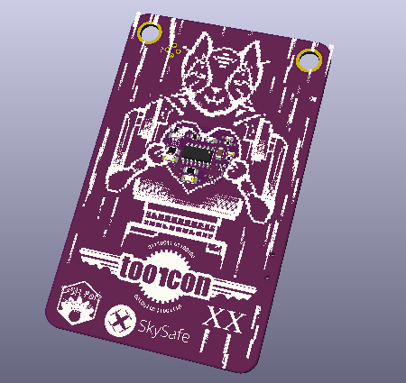

Introduction
============

 

Test your surface mount soldering skills out, starting with a 1206 package and work your way down into an oblivion of frustration. Powered by a CR2032 coin cell and Attiny 84 SOIC-14. Be warned that trying to hand solder a 0201 package, which is just slightly larger than a grain of sand, may be considered evidence of insanity and get you committed to bad places by your loved ones and/or arch nemesis. I have submitted to request from miserable people to make this an unfortunate kit. Don't think I'm doing you any favors: https://www.tindie.com/products/MakersBox/smd-challenge/

Bill Of Materials
================= 
| QTY | REF   | Description                          | Manufacturer    | Manufacturer PN   | Digi-Key PN           |
|-----|-------|--------------------------------------|-----------------|-------------------|-----------------------|
| 1   | U1    | IC MCU 8BIT 8KB FLASH 14SOIC         | Microchip       | ATTINY84A-SSUR    | ATTINY84A-SSURCT-ND   |
| 1   | C1    | CAP CER 0.1UF 250V X7R 1206          | Samsung         | CL31B104KEHSNNE   | 1276-3084-1-ND        |
| 1   | BT1   | HOLDER BATTERY 20MM COIN             | Linx            | BAT-HLD-001       | BAT-HLD-001-ND        |
| 2   | D1-D2 | LED RED CLEAR 1206 SMD               | Lite-On Inc.    | LTST-C150KRKT     | 160-1405-1-ND         |
| 2   | D2-D4 | LED ORANGE CLEAR 0805 SMD            | Dialight        | 5988130107F       | 350-2040-1-ND         |
| 2   | D5-D6 | LED AMBER DIFFUSED SMD 0603          | Broadcom        | ASMT-RA45-AP932   | 516-3217-1-ND         |
| 1   | D7    | LED YELLOW CLEAR CHIP SMD 0402       | Kingbright      | APHHS1005SYCK     | 754-1105-1-ND         |
| 2   | D8    | LED GREEN CLEAR 2SMD 0201            | Kingbright      | APG0603CGC-TT     | 754-2021-1-ND         |
| 2   | R1-R2 | RES SMD 100 OHM 5% 1/4W 1206         | Panasonic       | ERJ-8GEYJ101V     | P100ECT-ND            |
| 2   | R3-R4 | RES SMD 100 OHM 5% 1/8W 0805         | Vishay Dale     | CRCW0805100RJNEAC | 541-4166-1-ND         |
| 2   | R5-R6 | RES SMD 100 OHM 5% 1/10W 0603        | Bourns Inc.     | CR0603-JW-101ELF  | CR0603-JW-101ELFCT-ND |
| 2   | R7    | RES 100 OHM 5% 1/16W 0402            | Stackpole       | RMCF0402JT100R    | RMCF0402JT100RCT-ND   |
| 4   | R8    | RES SMD 100 OHM 5% 1/20W 0201        | Yageo           | RC0201JR-07100RL  | 311-100NCT-ND         |
| 1   | SW1   | SWITCH SLIDE SPDT 300MA 6V           | C&K             | JS102011SAQN      | 401-1999-1-ND         |
| 1   | -     | Perfect Purple PCB from design files | OSH Park        | -                 | -                     |
| 1   | -     | BAG 4X6" ZIP STATIC SHIELD 1=1EA     | SCS             | 30046             | SCP314-ND             |
| 1   | -     | CR2032 Battery                       | Amazon or local | -                 | -                     |

Design Files
============
This project is designed using Open Source [KiCad](http://kicad-pcb.org/). Design files are located in the [design_files](design_files/) folder.  You can oogle the [schematic](images/project.sch.png).

Firmware
========
This project is programed using the Open Source [Arduino](https://www.arduino.cc/). I use my Open Source [AVR Programming Shield](https://www.tindie.com/products/MakersBox/yet-another-programming-shield/) to program the Attiny. The firmware is located in the [firmware](firmware/) folder.

Assembly Instructions
=====================
I have posted [minimal instructions at HackADay](https://hackaday.io/project/25265-an-unfortunate-smd-project).

License
=======
[Attribution-ShareAlike 3.0 United States (CC BY-SA 3.0 US)](https://creativecommons.org/licenses/by-sa/3.0/us/)

You are free to:

- Share — copy and redistribute the material in any medium or format
- Adapt — remix, transform, and build upon the material

Under the following terms:

- Attribution — You must give appropriate credit, provide a link to the license, and indicate if changes were made. You may do so in any reasonable manner, but not in any way that suggests the licensor endorses you or your use.
- ShareAlike — If you remix, transform, or build upon the material, you must distribute your contributions under the same license as the original.
