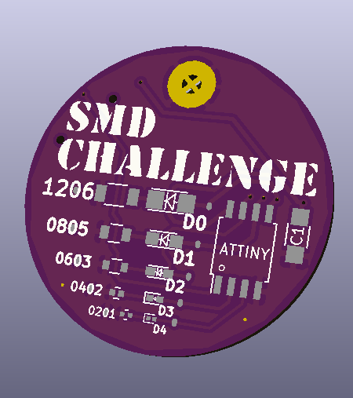

Introduction
============

 
Test your surface mount soldering skills out, starting with a 1206 package and work your way down into an oblivion of frustration. Powered by a CR2032 coin cell and Attiny 85 SOIC. Be warned that trying to hand solder a 0201 package, which is just slightly larger than a grain of sand, may be considered evidence of insanity and get you committed to bad places by your loved ones and/or arch nemesis.I have submitted to request from miserable people to make this an unfortunate kit. Don't think I'm doing you any favors: https://www.tindie.com/products/MakersBox/smd-challenge/

Bill Of Materials
=================
  
- 1 ea., Perfect Purple PCB from OSH Park, https://oshpark.com/shared_projects/UFefat4N
- 1 ea., Atmel ATTINY25V-10SNR, Digikey 1611-ATTINY25V-10SNRCT-ND
- 1 ea., CAP CER 0.1UF 50V X7R 1206, KEMET C1206C104K5RAC7867, https://www.digikey.com/short/32vmjq
- 1 ea., LED RED CLEAR 1206 SMD, Lite-On LTST-C150KRKT, https://www.digikey.com/short/3253m7
- 1 ea., RES SMD 100 OHM 5% 1/4W 1206, Digiket P100ECT-ND
- 1 ea., LED ORANGE CLEAR 0805 SMD, https://www.digikey.com/short/qjwthb
- 1 ea., RES SMD 100 OHM 5% 1/8W 0805, https://www.digikey.com/short/z7nv19
- 1 ea., LED YELLOW CLEAR 0603 SMD, Lite-On LTST-C191KSKT, https://www.digikey.com/short/3wzzr2
- 1 ea., RES SMD 100 OHM 5% 1/10W 0603, https://www.digikey.com/short/z7n1cv
- 1 ea., LED GREEN CLEAR 0402 SMD, SunLED XZVG68W-2, https://www.digikey.com/short/3wzzfm
- 1 ea., RES 100 OHM 5% 1/16W 0402, https://www.digikey.com/short/z7n132
- 1 ea., LED BLUE CLEAR 0201 SMD, Kingbright APG0603PBC-TT-5MAV, https://www.digikey.com/short/3wzzfr
- 1 ea., RES SMD 100 OHM 5% 1/20W 0201, https://www.digikey.com/short/z7n18r
- 1 ea. SMD Battery holder, Linx BAT-HLD-001, Digikey BAT-HLD-001-ND
- 1 ea. CR2032 Battery, Panasonic CR2032, Digikey P189-ND (requires ground shipping, or buy locally).

Design Files
============
This project is designed using Open Source [KiCad](http://kicad-pcb.org/). Design files are located in the [design_files](design_files/) folder.  You can oogle the [schematic](images/project.sch.png).

Firmware
========
This project is programed using the Open Source [Arduino](https://www.arduino.cc/). I use my Open Source [AVR Programming Shield](https://www.tindie.com/products/MakersBox/yet-another-programming-shield/) to program the Attiny. The firmware is located in the [firmware](firmware/) folder.

Assembly Instructions
=====================
I have posted [minimal instructions at HackADay](https://hackaday.io/project/25265-an-unfortunate-smd-project).

License
=======
[Attribution-ShareAlike 3.0 United States (CC BY-SA 3.0 US)](https://creativecommons.org/licenses/by-sa/3.0/us/)

You are free to:

- Share — copy and redistribute the material in any medium or format
- Adapt — remix, transform, and build upon the material

Under the following terms:

- Attribution — You must give appropriate credit, provide a link to the license, and indicate if changes were made. You may do so in any reasonable manner, but not in any way that suggests the licensor endorses you or your use.
- ShareAlike — If you remix, transform, or build upon the material, you must distribute your contributions under the same license as the original.
