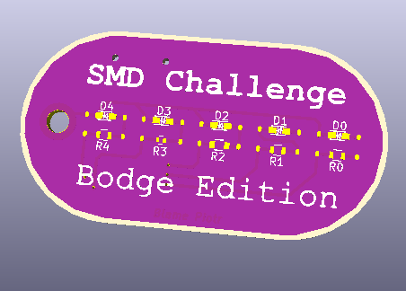

SMD Challenge Bodge Edition
----------------

 
This SMD Challenge is designed to test your troubleshooting and repair skills. The layout was done by the summer intern and didn't get reviewed before being sent out for fab. The PCBs and parts showed up today, and it falls on you to build the working demo for the client visit tomorrow morning.  All you have to do is make the LEDs blink in order, before you go home today, or you are fired. Good luck.

Bill Of Materials
----------------
  
- 1 ea., Perfect Purple PCB from OSH Park, with not so perfect layout from [design_files](design_files/) folder.
- 1 ea., Atmel ATTINY85V-10SUR, https://www.digikey.com/short/3253mp, flashed beforehand from [firmware](firmware/) folder
- 1 ea., CAP CER 0.1UF 0603 SMD, https://www.digikey.com/short/pq0m22 
- 5 ea., LEDs 0603, your choice of colors
- 5 ea., Resistors 0603 SMD, maybe 100 ohm-ish?
- 1 ea., SMD Battery holder, Linx BAT-HLD-001, Digikey BAT-HLD-001-ND
- 1 ea., CR2032 Battery, Panasonic CR2032, Digikey P189-ND (requires ground shipping, or buy locally).

Design Files
----------------
This project is designed using Open Source [KiCad](http://kicad-pcb.org/). Design files are located in the [design_files](design_files/) folder.  You can oogle the [schematic](docs/project.sch.pdf).

Firmware
----------------
This project is programed using the Open Source [Arduino](https://www.arduino.cc/). I use my Open Source [AVR Programming Shield](https://www.tindie.com/products/MakersBox/yet-another-programming-shield/) to program the Attiny. The firmware is located in the [firmware](firmware/) folder.

Assembly Instructions
----------------
I have posted [minimal instructions at HackADay](https://hackaday.io/project/25265-an-unfortunate-smd-project).
If you are stuck, and in tears, send me a cry for help. I am not evil, and most of the errors on the board are ones I have made in the past, so you can learn from my mistakes.

License
----------------
[Attribution-ShareAlike 3.0 United States (CC BY-SA 3.0 US)](https://creativecommons.org/licenses/by-sa/3.0/us/)

You are free to:

- Share — copy and redistribute the material in any medium or format
- Adapt — remix, transform, and build upon the material

Under the following terms:

- Attribution — You must give appropriate credit, provide a link to the license, and indicate if changes were made. You may do so in any reasonable manner, but not in any way that suggests the licensor endorses you or your use.
- ShareAlike — If you remix, transform, or build upon the material, you must distribute your contributions under the same license as the original.
