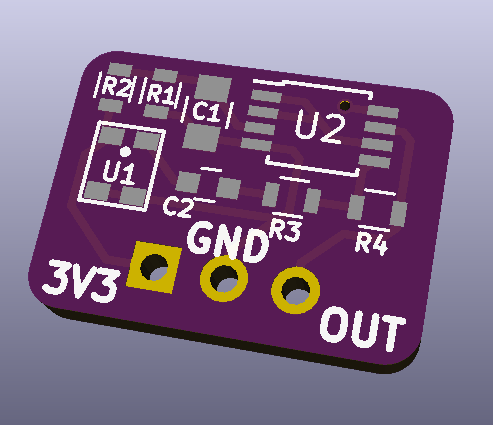

Microphone Breakout
------------

 

SPW2430 MEMs Microphone with LMV358 amplifyier

Bill Of Materials
-----------------

- 1 ea., Perfect Purple PCB from OSH Park
- 1 ea., U1 MEMS microphone, Knowles SPW2430HR5H-B, https://www.digikey.com/product-detail/en/knowles/SPW2430HR5H-B/423-1394-1-ND/5052772
- 1 ea., U2 IC OPAMP GP 1MHZ RRO 8VSSOP, TI LMV358MMX/NOPB, https://www.digikey.com/short/jrwr2f
- 1 ea., C1 1uF CAP SMD 0805
- 1 ea., C2 0l1uF CAP SMD 0605
- 1 ea., R1 20K SMD 0605 Resistor
- 1 ea., R2 10K SMD 0605 Resistor
- 1 ea., R3 1K SMD 0605 Resistor
- 1 ea., R4 100K SMD 0605 Resistor

Design Files
------------
The electronics were designed using Open Source [KiCad](http://kicad-pcb.org/). Design files are located in the [design_files](design_files/) folder.  You can oogle the [schematic](docs/schematic.pdf).

Firmware
--------
This project is programed using the Open Source [Arduino](https://www.arduino.cc/). I use my Open Source [AVR Programming Shield](https://www.tindie.com/products/MakersBox/yet-another-programming-shield/). The firmware is located in the [firmware](firmware/) folder.
Note: The microphone is a 3V device (3.6v max).  Use a level translator with the programmer (https://www.sparkfun.com/products/11771) to avoid applying 5V to the sensor during programming!

Assembly Instructions
---------------------
TODO

License
-------
[Attribution-ShareAlike 3.0 United States (CC BY-SA 3.0 US)](https://creativecommons.org/licenses/by-sa/3.0/us/)

You are free to:

- Share — copy and redistribute the material in any medium or format
- Adapt — remix, transform, and build upon the material

Under the following terms:

- Attribution — You must give appropriate credit, provide a link to the license, and indicate if changes were made. You may do so in any reasonable manner, but not in any way that suggests the licensor endorses you or your use.
- ShareAlike — If you remix, transform, or build upon the material, you must distribute your contributions under the same license as the original.
