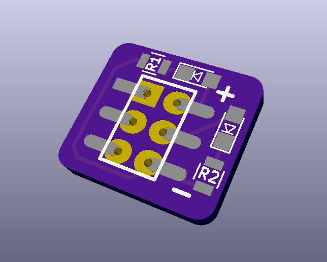

Introduction
------------

 
A small pogo adapter to use with SMD ISP pads and an [AVR programmer](https://www.instructables.com/id/Arduino-AVR-Progamming-Shield/).

Bill Of Materials
-----------------

- 1 ea., Perfect Purple PCB from OSH Park
- 1 ea., 2X3POS DIL VERTICAL SMT HEADER, https://www.digikey.com/short/jm9ww5
- 6 ea., Pogo Pin, Mill-Max 0906-0-15-20-76-14-11-0, https://www.digikey.com/products/en?keywords=0906-0-15-20-76-14-11-0
- 1 ea., LED 0805 Orange, Dialight 5988130107F, https://www.digikey.com/product-detail/en/dialight/5988130107F/350-2040-1-ND/1291344 
- 1 ea., LED 0805 Green, Dialight 5988170107F, https://www.digikey.com/product-detail/en/dialight/5988170107F/350-2044-1-ND/1291348
- 2 ea., Resistor 330 SMD, Yageo RC0805JR-07330RL, https://www.digikey.com/short/3wzz2f

Design Files
------------
The electronics were designed using Open Source [KiCad](http://kicad-pcb.org/). Design files are located in the [design_files](design_files/) folder.  You can oogle the [schematic](docs/Schematic.pdf).

Firmware
--------
None

Assembly Instructions
---------------------
TODO

License
-------
[Attribution-ShareAlike 3.0 United States (CC BY-SA 3.0 US)](https://creativecommons.org/licenses/by-sa/3.0/us/)

You are free to:

- Share — copy and redistribute the material in any medium or format
- Adapt — remix, transform, and build upon the material

Under the following terms:

- Attribution — You must give appropriate credit, provide a link to the license, and indicate if changes were made. You may do so in any reasonable manner, but not in any way that suggests the licensor endorses you or your use.
- ShareAlike — If you remix, transform, or build upon the material, you must distribute your contributions under the same license as the original.
