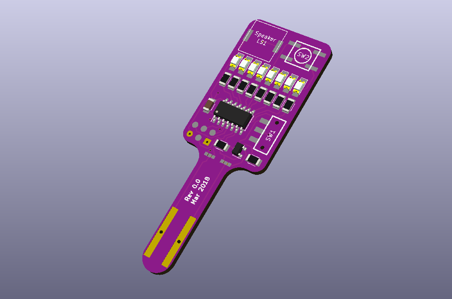

Introduction
============

 
THIS DESIGN IS UNTESTED!

Bill Of Materials
=================

- 1 ea., Perfect Purple PCB from OSH Park,
- 1 ea., Attiny84A SOIC14, https://www.digikey.com/product-detail/en/microchip-technology/ATTINY84A-SSUR/ATTINY84A-SSURCT-ND/2774136 
- 1 ea., NPN SOT-23, Diodes Inc MMBT3904-7-F, https://www.digikey.com/product-detail/en/diodes-incorporated/MMBT3904-7-F/MMBT3904-FDICT-ND/815727
- 1 ea., RES 10K SMD 1206, Yageo RC1206JR-0710KL, https://www.digikey.com/product-detail/en/yageo/RC1206JR-0710KL/311-10KERCT-ND/732156
- 1 ea., RES 100 SMD 1206, Yageo RC1206JR-07100RL, https://www.digikey.com/product-detail/en/yageo/RC1206JR-07100RL/311-100ERCT-ND/732153
- 1 ea., SMD SPST switch, C&K JS102011SAQN, Digikey 401-1999-1-ND
- 1 ea., SWITCH TACTILE SPST, https://www.digikey.com/product-detail/en/c-k/PTS525SM15SMTR2-LFS/CKN9104CT-ND/1146923
- 2 ea., Red 1206 LED, Lite-On LTST-C230KRKT, Digikey 160-1405-1-ND, https://www.digikey.com/product-detail/en/lite-on-inc/LTST-C230KRKT/160-1457-1-ND/386856
- 2 ea., orange 1206 LED, Lite-On LTST-C230KFKT, https://www.digikey.com/product-detail/en/lite-on-inc/LTST-C230KFKT/160-2025-1-ND/3711400
- 2 ea., yellow 1206 LED, Lite-On LTST-C150KSKT, https://www.digikey.com/product-detail/en/lite-on-inc/LTST-C150KSKT/160-1406-1-ND/386762
- 2 ea., green 1206 LED, Lite-On LTST-C230KGKT, https://www.digikey.com/product-detail/en/lite-on-inc/LTST-C230KGKT/160-1456-1-ND/386854
- 1 ea., 0.1 uF cap 1206, https://www.digikey.com/product-detail/en/yageo/CC1206KRX7R9BB104/311-1179-1-ND/303089
- 1 ea., SMD Battery holder, Linx BAT-HLD-001, Digikey BAT-HLD-001-ND
- 1 ea., AUDIO PIEZO TRANSDUCER 12.5V SMD, Murata PKMCS0909E4000-R1, https://www.digikey.com/short/qjn4nh
- 1 ea., CR2032 Battery, Panasonic CR2032, Digikey P189-ND (requires ground shipping, or buy locally).

Design Files
============
This project is designed using Open Source [KiCad](http://kicad-pcb.org/). Design files are located in the [design_files](design_files/) folder.  You can oogle the [schematic](docs/project.pdf).

Firmware
========
This project is programed using the Open Source [Arduino](https://www.arduino.cc/). I use my Open Source [AVR Programming Shield](https://www.tindie.com/products/MakersBox/yet-another-programming-shield/) to program the Attiny84. The firmware is located in the [firmware](firmware/) folder.

Assembly Instructions
=====================
Not yet.

License
=======
[Attribution-ShareAlike 3.0 United States (CC BY-SA 3.0 US)](https://creativecommons.org/licenses/by-sa/3.0/us/)

You are free to:

- Share — copy and redistribute the material in any medium or format
- Adapt — remix, transform, and build upon the material

Under the following terms:

- Attribution — You must give appropriate credit, provide a link to the license, and indicate if changes were made. You may do so in any reasonable manner, but not in any way that suggests the licensor endorses you or your use.
- ShareAlike — If you remix, transform, or build upon the material, you must distribute your contributions under the same license as the original.
