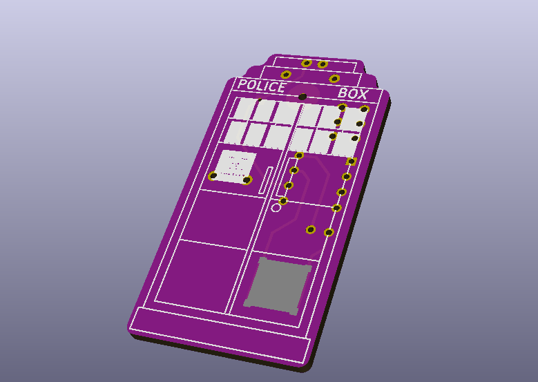

Introduction
============

 
Um, its a TARDIS.

Bill Of Materials
-----------------
  
- 1 ea., Perfect Purple PCB from OSH Park, 
- 1 ea., Attiny85, [Atmel ATTINY85V-10PU](https://www.digikey.com/short/3ntz53)
- 1 ea., SPDT Switch [C&K JS202011AQN](https://www.digikey.com/short/j48ddn)
- 1 ea., White diffuse 5mm LED, [Lumex SSL-LX5093UWW](https://www.digikey.com/short/j48dv8)
- 1 ea., 330 Ohm resisor 1/8w, [Stackpole CF18JT330K](https://www.digikey.com/short/j48dnf)
- 1 ea., Piezo speaker, [TDK PS1240P02CT3](http://www.digikey.com/short/7hcrp1)
- 1 ea., CAP CER 0.1UF [Vishay BC1160CT-ND](https://www.digikey.com/short/314jvp)
- 1 ea., SMD Battery holder, Linx BAT-HLD-001, Digikey BAT-HLD-001-ND
- 1 ea., CR2032 Battery, Panasonic CR2032, Digikey P189-ND (requires ground shipping, or buy locally).

Design Files
------------
This project is designed using Open Source [KiCad](http://kicad-pcb.org/). Design files are located in the [design_files](design_files/) folder.  You can oogle the [schematic](images/project.sch.png).

Firmware
--------
This project is programed using the Open Source [Arduino](https://www.arduino.cc/). I use my Open Source [AVR Programming Shield](https://www.tindie.com/products/MakersBox/yet-another-programming-shield/) to program the Attiny. The firmware is located in the [firmware](firmware/) folder.

Assembly Instructions
---------------------
TBD

License
-------
[Attribution-ShareAlike 3.0 United States (CC BY-SA 3.0 US)](https://creativecommons.org/licenses/by-sa/3.0/us/)

You are free to:

- Share — copy and redistribute the material in any medium or format
- Adapt — remix, transform, and build upon the material

Under the following terms:

- Attribution — You must give appropriate credit, provide a link to the license, and indicate if changes were made. You may do so in any reasonable manner, but not in any way that suggests the licensor endorses you or your use.
- ShareAlike — If you remix, transform, or build upon the material, you must distribute your contributions under the same license as the original.
