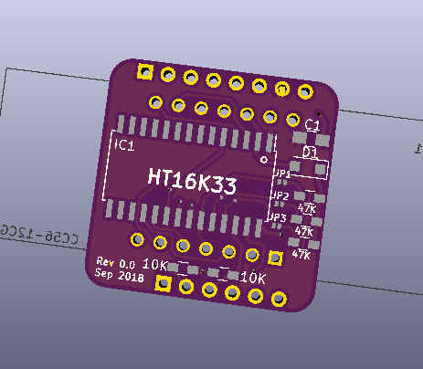

Beetje Blok 7-SEG Rev 0.0

 

Project website: https://hackaday.io/project/160638-beetje-bloks

Based on Adafruit's [LED Backpack]{https://learn.adafruit.com/adafruit-led-backpack/downloads}. 

Bill Of Materials
----------------
  
- 1 ea., Perfect Purple PCB from OSH Park, with not so perfect layout from [design_files](design_files/) folder.
- 1 ea., IC1 Holtek HT16K33
- 1 ea., U1 7-segment CC LED
- 1 ea., C1 CAP CER 10UF 50V X7R, https://www.digikey.com/short/j5d39w 
- 2 ea., R1, R2 Resistor 10K 0805 SMD, https://www.digikey.com/short/j2d0w4
- 3 ea., R3, R4, R5 Resistor 47K 0805 SMD, https://www.digikey.com/short/j2d00m 
- 1 ea., CONN HEADER .100" SNGL STR 40POS, https://www.digikey.com/short/jfcn42
- 1 ea., SW1 RA Tactile SPST, Pansonic EVQ-P7J01P, https://www.digikey.com/short/jfwprn

License
----------------
[Attribution-ShareAlike 3.0 United States (CC BY-SA 3.0 US)](https://creativecommons.org/licenses/by-sa/3.0/us/)

You are free to:

- Share — copy and redistribute the material in any medium or format
- Adapt — remix, transform, and build upon the material

Under the following terms:

- Attribution — You must give appropriate credit, provide a link to the license, and indicate if changes were made. You may do so in any reasonable manner, but not in any way that suggests the licensor endorses you or your use.
- ShareAlike — If you remix, transform, or build upon the material, you must distribute your contributions under the same license as the original.