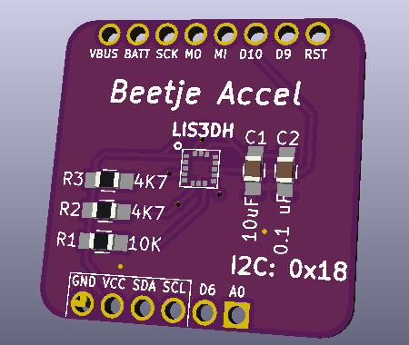

Beetje Blok Accel

Project website: https://hackaday.io/project/160638-beetje-bloks

Bill Of Materials
----------------
  
- 1 ea., Perfect Purple PCB from OSH Park, with not so perfect layout from [project.kicad_pcb](project.kicad_pcb) file.
- 1 ea., U1 ACCEL 2-16G I2C/SPI 16LGA, STM LIS3DHTR, https://www.digikey.com/short/j5n09v 
- 1 ea., C1 10uF CAP SMD 0805, https://www.digikey.com/short/jnwj88
- 1 ea., C2 0.1uF CAP SMD 0805, https://www.digikey.com/short/j58qjp
- 1 ea., R1 10K OHM SMD 0805, https://www.digikey.com/short/j2d0w4 
- 2 ea., R2, R3 4K7 OHM SMD 0805, https://www.digikey.com/short/j2d0wd

Revisions
------------------

0.1 Pinout to Rev 0.3, 0805 Footprints

License
----------------
[Attribution-ShareAlike 3.0 United States (CC BY-SA 3.0 US)](https://creativecommons.org/licenses/by-sa/3.0/us/)

You are free to:

- Share — copy and redistribute the material in any medium or format
- Adapt — remix, transform, and build upon the material

Under the following terms:

- Attribution — You must give appropriate credit, provide a link to the license, and indicate if changes were made. You may do so in any reasonable manner, but not in any way that suggests the licensor endorses you or your use.
- ShareAlike — If you remix, transform, or build upon the material, you must distribute your contributions under the same license as the original.