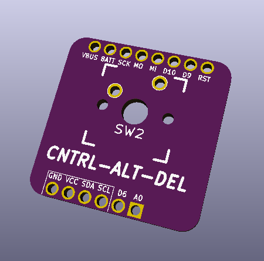

Beetje Blok Template

Project website: https://hackaday.io/project/160638-beetje-bloks
Cherry Key footprint: https://github.com/BathroomEpiphanies/KiCAD-Keyboard-Tutorial

Bill Of Materials
----------------
  
- 1 ea., Perfect Purple PCB from OSH Park, with not so perfect layout from [project.kicad_pcb](project.kicad_pcb) file.
- 1 ea.,  https://www.banggood.com/10-Pcs-Cherry-Red-3-Pin-MX-RGB-Series-Mechanical-Switch-Keyboard-Replacement-p-1114348.html
- 1 ea., https://www.banggood.com/R4-ESC-PBT-Red-Blank-Keycaps-Key-Caps-for-Mechanical-Gaming-Keyboard-p-1173201.html

Optional

- 1 ea., CONN HEADER .100" SNGL STR 40POS, https://www.digikey.com/short/jfcn42

License
----------------
[Attribution-ShareAlike 3.0 United States (CC BY-SA 3.0 US)](https://creativecommons.org/licenses/by-sa/3.0/us/)

You are free to:

- Share — copy and redistribute the material in any medium or format
- Adapt — remix, transform, and build upon the material

Under the following terms:

- Attribution — You must give appropriate credit, provide a link to the license, and indicate if changes were made. You may do so in any reasonable manner, but not in any way that suggests the licensor endorses you or your use.
- ShareAlike — If you remix, transform, or build upon the material, you must distribute your contributions under the same license as the original.