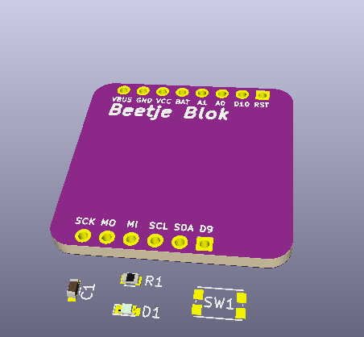

Beetje Blok Template

This is the place to start if you want to design a Beetje Blok. Contains frequently used parts in footprints.pretty folder. Project website: https://hackaday.io/project/160638-beetje-bloks

https://playground.arduino.cc/code/I2CEEPROM
https://www.instructables.com/id/Add-I2C-EEPROM-to-Arduino/

Bill Of Materials
----------------
  
- 1 ea., Perfect Purple PCB from OSH Park, with not so perfect layout from [project.kicad_pcb](project.kicad_pcb) file.
- 1 ea., C1 CAP CER 0.1UF 50V X7R 0805, https://www.digikey.com/short/j58qjp
- 1 ea., R1, R2 4K7 0603 SMD Resistor, 

- 1 ea., U1, IC EEPROM 1M I2C 1MHZ 8SOIC, https://www.digikey.com/short/jf10qw
 or
- 1 ea., U1, IC EEPROM 1M I2C 400KHZ 8SOIC, https://www.digikey.com/short/jf10h0

Optional

- 1 ea., CONN HEADER .100" SNGL STR 40POS, https://www.digikey.com/short/jfcn42
- J2, CONN HEADER FEMALE 6POS .1" GOLD, https://www.digikey.com/short/jfcnz3
- J4, CONN HEADER FEMALE 8POS .1" GOLD, https://www.digikey.com/short/jfcnzj

License
----------------
[Attribution-ShareAlike 3.0 United States (CC BY-SA 3.0 US)](https://creativecommons.org/licenses/by-sa/3.0/us/)

You are free to:

- Share — copy and redistribute the material in any medium or format
- Adapt — remix, transform, and build upon the material

Under the following terms:

- Attribution — You must give appropriate credit, provide a link to the license, and indicate if changes were made. You may do so in any reasonable manner, but not in any way that suggests the licensor endorses you or your use.
- ShareAlike — If you remix, transform, or build upon the material, you must distribute your contributions under the same license as the original.