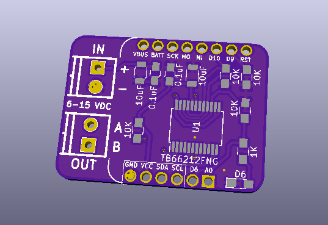

Beetje H-Bridge

 

Project website: https://hackaday.io/project/160638-beetje-bloks

Bill Of Materials
----------------
  
- 1 ea., Perfect Purple PCB from OSH Park, with not so perfect layout from [project.kicad_pcb](project.kicad_pcb) file.
- 1 ea., TC78H651FNG IC MOTOR DRIVER 16TSSOP, https://www.digikey.com/short/z8r9nr
- 1 ea., CAP CER 10UF 25V 1206, https://www.digikey.com/short/j29pwm
- 1 ea., CAP CER 1UF 16V X7R 0805, https://www.digikey.com/short/z8dz2m
- 1 ea., TRIMMER 10K OHM 0.1W J LEAD TOP, https://www.digikey.com/short/zq5dpc
- 1 ea., D2 LED SMD 0805, https://www.digikey.com/short/jwf4nw
- 4 ea., R3-R8 10K SMD 0805, https://www.digikey.com/short/j2d0w4 
- 1 ea., R2 1K SMD 0805, https://www.digikey.com/short/j2d0wt
- 3 ea., J1, J3, J5 TERM BLOCK PCB 2POS 5.0MM GREEN, Phoenix 1935161 https://www.digikey.com/short/jnrmvw
- 1 ea., 64-pin header(enough for 4.5 boards) Mill-max 311-43-164-41-001000, https://www.digikey.com/short/jnqdm2

Revisions
------------------
0.3 Switched from TB6612FNG to TC78H651FNG, added potentiometer, removed MCP chip.

License
----------------
[Attribution-ShareAlike 3.0 United States (CC BY-SA 3.0 US)](https://creativecommons.org/licenses/by-sa/3.0/us/)

You are free to:

- Share — copy and redistribute the material in any medium or format
- Adapt — remix, transform, and build upon the material

Under the following terms:

- Attribution — You must give appropriate credit, provide a link to the license, and indicate if changes were made. You may do so in any reasonable manner, but not in any way that suggests the licensor endorses you or your use.
- ShareAlike — If you remix, transform, or build upon the material, you must distribute your contributions under the same license as the original.