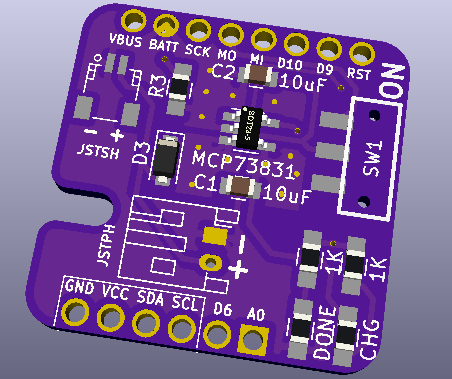

Beetje LiPo Battery Blok

 

Project website: https://hackaday.io/project/160638-beetje-bloks

Based on Adafruit's [Adafruit Pro Trinket LiPoly/LiIon Backpack](https://learn.adafruit.com/adafruit-pro-trinket-lipoly-slash-liion-backpack/downloads)

Try adding TVS: https://www.digikey.com/product-detail/en/stmicroelectronics/SM2T3V3A/497-7878-1-ND/1883813
https://www.digikey.com/product-detail/en/comchip-technology/CPDQC3V3T-HF/641-1893-1-ND/7100791
Update to 0805 parts

Bill Of Materials
----------------
  
- 1 ea., Perfect Purple PCB from OSH Park, with not so perfect layout from [project.kicad_pcb](project.kicad_pcb) file.
- 2 ea., CAP CER 10UF 25V 1206, https://www.digikey.com/short/j29pwm
- 1 ea., U1 IC LI-ION/LI-POLY CTRLR 10MSOP, MCP73833T-AMI/UN, https://www.digikey.com/short/zjdzwb
- 1 ea., BATTERY LITHIUM 3.7V 150MA, TinyCircuits ASR00003, https://www.digikey.com/short/jf925w
- 1 ea., JST SH CONN HEADER SH 2POS 1MM, SM02B-SRSS-TB(LF)(SN), https://www.digikey.com/short/jfdccc
- 1 ea., JST PH CONN HEADER PH SIDE 2POS 2MM, S2B-PH-K-S(LF)(SN), https://www.digikey.com/short/jfdct5
- 1 ea., R4 Resistor 10K SMD 0805, https://www.digikey.com/short/j2d0w4
- 1 ea., R5 Resistor 4K7 SMD 0805, https://www.digikey.com/short/zjdz12
- 3 ea., R1-R3 Resistor 1K SMD 0805, https://www.digikey.com/short/j2d0wt
- 1 ea., D1 LED red SMD 0805, https://www.digikey.com/short/j20zct
- 1 ea., D2 LED green SMD 0805, https://www.digikey.com/short/j20p1h
- 1 ea., D3 LED ORANGE CLEAR 0805 SMD, https://www.digikey.com/short/qjwthb
- 2 ea., D4 DIODE SCHOTTKY 20V 1A SOD123FL, MBR120ESFT1G, https://www.digikey.com/short/jnqvz9
- 1 ea., SMD SPST switch, C&K JS102011SAQN, Digikey 401-1999-1-ND

Revisions
------------------
- 0.0 Aug 2018 Initial build
- 0.1 Sep 2018 Switch to 0805 packages. Swap J1 & J3 connector polarities.  Add power switch and reverse current diode.
- 0.2 Sep 2018 Pinout to match 32U4 rev 0.3, added pour planes per datasheet, rerouted.
- 0.3 Sep 2018 Fixed LED footprints.
- 0.5 Apr 2020 Switch to MCP7833 Chip, enlarged header holes.
- 0.6 Apr 2020 Switched silkscreen on CHG/DONE LEDs

License
----------------
[Attribution-ShareAlike 3.0 United States (CC BY-SA 3.0 US)](https://creativecommons.org/licenses/by-sa/3.0/us/)

You are free to:

- Share — copy and redistribute the material in any medium or format
- Adapt — remix, transform, and build upon the material

Under the following terms:

- Attribution — You must give appropriate credit, provide a link to the license, and indicate if changes were made. You may do so in any reasonable manner, but not in any way that suggests the licensor endorses you or your use.
- ShareAlike — If you remix, transform, or build upon the material, you must distribute your contributions under the same license as the original.