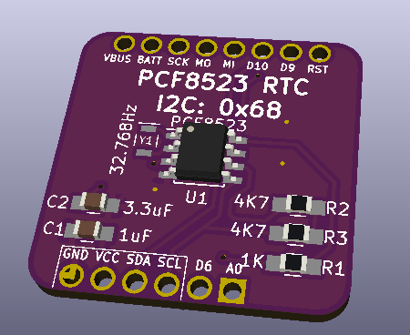

Beetje RTC

 

Project website: https://hackaday.io/project/160638-beetje-bloks

Based on Adafruit's [PCF8523 Real Time Clock Assembled Breakout Board](https://www.adafruit.com/product/3295)

Bill Of Materials
----------------
  
- 1 ea., Perfect Purple PCB from OSH Park from [design_files](design_files/) folder.
- 1 ea., U1 IC RTC CLK/CALENDAR I2C 8-SOIC, NXP PCF8523T/1,118, https://www.digikey.com/short/j5n049
- 1 ea., Y1 CRYSTAL 32.7680KHZ 12.5PF 2-SMD, ECS ECS-.327-12.5-34B-TR, https://www.digikey.com/short/jfhppz
- 1 ea., R1 RES 1K OHM 5% 0805, https://www.digikey.com/short/j2d0wt
- 2 ea., R2-3 RES 4K7 OHM 5% 0805, https://www.digikey.com/short/j2d0wd 
- 1 ea., C1 CAP 1uF 0805, https://www.digikey.com/short/jwjfn1
- 1 ea., C2 CAP 3.3uF 0805, https://www.digikey.com/short/jnw857
- 1 ea., BT1 CR1220 Holder, MPD BK-885-TR, https://www.digikey.com/short/jfhzc9

Optional
----------------

- Headers

Revisions
------------------

License
----------------
[Attribution-ShareAlike 3.0 United States (CC BY-SA 3.0 US)](https://creativecommons.org/licenses/by-sa/3.0/us/)

You are free to:

- Share — copy and redistribute the material in any medium or format
- Adapt — remix, transform, and build upon the material

Under the following terms:

- Attribution — You must give appropriate credit, provide a link to the license, and indicate if changes were made. You may do so in any reasonable manner, but not in any way that suggests the licensor endorses you or your use.
- ShareAlike — If you remix, transform, or build upon the material, you must distribute your contributions under the same license as the original.