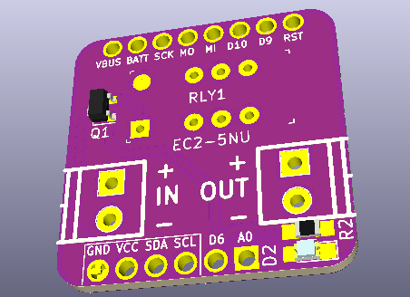

Beetje Relay

 

Project website: https://hackaday.io/project/160638-beetje-bloks

Bill Of Materials
----------------
  
- 1 ea., Perfect Purple PCB from OSH Park, with not so perfect layout from [project.kicad_pcb](project.kicad_pcb) file.
- 1 ea., RLY1 RELAY GEN PURPOSE DPDT 2A 250V, https://www.digikey.com/short/jwfmr5
- 1 ea., Q1 TRANS NPN 40V 0.2A SOT23, MMBT3904-TP, https://www.digikey.com/short/jbpvh0
- 1 ea., D2 LED SMD 0805, https://www.digikey.com/short/jwf4nw
- 1 ea., R2 1K SMD 0805, https://www.digikey.com/short/j2d0wt
- 2 ea., J1, J3 TERM BLOCK PCB 2POS 5.0MM GREEN, Phoenix 1935161 https://www.digikey.com/short/jnrmvw
- 1 ea., 64-pin header(enough for 4.5 boards) Mill-max 311-43-164-41-001000, https://www.digikey.com/short/jnqdm2

Revisions
------------------
0.1 Moved relay to avoid short on USB. Removed full fills to avoid shorts if using AC in relay. 
    Added messages about possible HV or AC on relay pins.
	Changed to 3.5mm terminal for 12 AWG wire.

	
License
----------------
[Attribution-ShareAlike 3.0 United States (CC BY-SA 3.0 US)](https://creativecommons.org/licenses/by-sa/3.0/us/)

You are free to:

- Share — copy and redistribute the material in any medium or format
- Adapt — remix, transform, and build upon the material

Under the following terms:

- Attribution — You must give appropriate credit, provide a link to the license, and indicate if changes were made. You may do so in any reasonable manner, but not in any way that suggests the licensor endorses you or your use.
- ShareAlike — If you remix, transform, or build upon the material, you must distribute your contributions under the same license as the original.