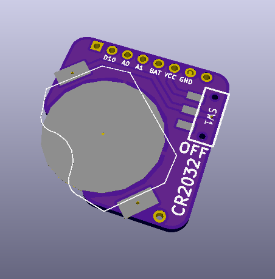

Beetje Blok CR2032

Project website: https://hackaday.io/project/160638-beetje-bloks

Bill Of Materials
----------------
  
- 1 ea., Perfect Purple PCB from OSH Park, with not so perfect layout from [project.kicad_pcb](project.kicad_pcb) file.
- 1 ea. SMD Battery holder, Linx BAT-HLD-001, Digikey BAT-HLD-001-ND
- 1 ea. SMD SPST switch, C&K JS102011SAQN, Digikey 401-1999-1-ND
- 1 ea. CR2032 Battery, Panasonic CR2032, Digikey P189-ND (requires ground shipping, or buy locally).
- 1 ea., CONN HEADER .100" SNGL STR 40POS, https://www.digikey.com/short/jfcn42

License
----------------
[Attribution-ShareAlike 3.0 United States (CC BY-SA 3.0 US)](https://creativecommons.org/licenses/by-sa/3.0/us/)

You are free to:

- Share — copy and redistribute the material in any medium or format
- Adapt — remix, transform, and build upon the material

Under the following terms:

- Attribution — You must give appropriate credit, provide a link to the license, and indicate if changes were made. You may do so in any reasonable manner, but not in any way that suggests the licensor endorses you or your use.
- ShareAlike — If you remix, transform, or build upon the material, you must distribute your contributions under the same license as the original.