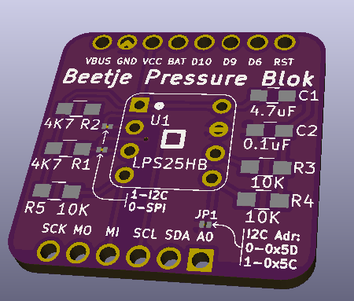

Beetje Blok Press Rev 0.1

 

Project website: https://hackaday.io/project/160638-beetje-bloks

Based on SparkFun's Qwiic Pressure Sensor https://www.sparkfun.com/products/14767

Bill Of Materials
----------------
  
- 1 ea., Perfect Purple PCB from OSH Park, with not so perfect layout from [design_files](design_files/) folder.
- 1 ea., U1 IC MEMS PRESSURE SENSOR 10HCLGA, ST LPS25HBTR, https://www.digikey.com/short/j2n1qn
- 1 ea., C1 CAP CER 4.7uF SMD 0805,https://www.digikey.com/short/j2dvcm 
- 1 ea., C2 CAP CER 0.1UF 50V X7R 0805, https://www.digikey.com/short/j58qjp
- 2 ea., R1, R2 Resistor 4.7K OHM SMD 0805, https://www.digikey.com/short/j2d0wd  
- 3 ea., R3, R4, R5 Resistor 10K OHM SMD 0805, https://www.digikey.com/short/j2d0w4  
- 1 ea., CONN HEADER .100" SNGL STR 40POS, https://www.digikey.com/short/jfcn42

License
----------------
[Attribution-ShareAlike 3.0 United States (CC BY-SA 3.0 US)](https://creativecommons.org/licenses/by-sa/3.0/us/)

You are free to:

- Share — copy and redistribute the material in any medium or format
- Adapt — remix, transform, and build upon the material

Under the following terms:

- Attribution — You must give appropriate credit, provide a link to the license, and indicate if changes were made. You may do so in any reasonable manner, but not in any way that suggests the licensor endorses you or your use.
- ShareAlike — If you remix, transform, or build upon the material, you must distribute your contributions under the same license as the original.