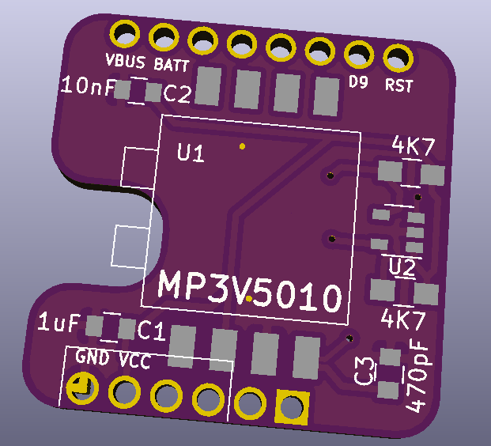

Beetje LiPo Pressure Diff

 

Project website: https://hackaday.io/project/160638-beetje-bloks

Bill Of Materials
----------------
  
- 1 ea., Perfect Purple PCB from OSH Park, with not so perfect layout from [project.kicad_pcb](project.kicad_pcb) file.
- 1 ea., U1 NXP MP3V5010DP pressor sensor, https://www.digikey.com/short/jwjfhm (see options below)
- 1 ea., C1 CAP CER 1uF SMD 0805, https://www.digikey.com/short/jwjfn1
- 1 ea., C2 CAP CER 0.01uF SMD 0805, https://www.digikey.com/short/jwjf0c
- 1 ea., C3 CAP CER 470PF SMD 0805, https://www.digikey.com/short/jwjfrp

Optional (for I2C ADC)
-----------------

- 1 ea., MCP2031 I2C ADC SO23-5, https://www.digikey.com/short/jnq819
	- MCP3021A0T-E/OT: Extended, A0 Address
	- MCP3021A1T-E/OT: Extended, A1 Address
	- MCP3021A2T-E/OT: Extended, A2 Address
	- MCP3021A3T-E/OT: Extended, A3 Address
	- MCP3021A4T-E/OT: Extended, A4 Address
	- MCP3021A5T-E/OT: Extended, A5 Address
	- MCP3021A6T-E/OT: Extended, A6 Address
	- MCP3021A7T-IE/OT: Extended, A7 Address
- 1 ea., MCP2031 I2C ADC SO23-5, https://www.digikey.com/short/jnq819
- 2 ea., 4.7K OHM 0805 Resistors, 

(hopefully) Compatible Sesnsors:
-------------------
| PN          | Pressure Type | Operating Pressure                      | Voltage - Supply |
|-------------|---------------|-----------------------------------------|------------------|
| MP3V5004GP  | Vented Gauge  | 0.57 PSI (3.92 kPa)                     | 2.7 V ~ 3.3 V    |
| MP3V5010DP  | Differential  | 1.45 PSI (10 kPa)                       | 2.7 V ~ 3.3 V    | * Tested
| MP3V5050GP  | Vented Gauge  | 7.25 PSI (50 kPa)                       | 2.7 V ~ 3.3 V    |
| MP3V5050DP  | Differential  | 7.25 PSI (50 kPa)                       | 2.7 V ~ 3.3 V    |
| MPXV5004GP  | Vented Gauge  | 0.57 PSI (3.92 kPa)                     | 4.75 V ~ 5.25 V  |
| MPXV7002GP  | Compound      | ±0.29 PSI (±2 kPa)                      | 4.75 V ~ 5.25 V  |
| MPXV5050GP  | Vented Gauge  | 7.25 PSI (50 kPa)                       | 4.75 V ~ 5.25 V  |
| MPXV7007GP  | Compound      | ±1.02 PSI (±7 kPa)                      | 4.75 V ~ 5.25 V  |
| MPXV5010GP  | Vented Gauge  | 1.45 PSI (10 kPa)                       | 4.75 V ~ 5.25 V  |
| MPXAZ6115AP | Absolute      | 2.18 PSI ~ 16.68 PSI (15 kPa ~ 115 kPa) | 4.75 V ~ 5.25 V  |
| MPXV5100GP  | Vented Gauge  | 14.5 PSI (100 kPa)                      | 4.75 V ~ 5.25 V  |
| MPXV4006GP  | Vented Gauge  | 0.87 PSI (6 kPa)                        | 4.75 V ~ 5.25 V  |

Revisions
------------------
0.2 Swaped orientation to put connections on right to avoid USB connector.

License
----------------
[Attribution-ShareAlike 3.0 United States (CC BY-SA 3.0 US)](https://creativecommons.org/licenses/by-sa/3.0/us/)

You are free to:

- Share — copy and redistribute the material in any medium or format
- Adapt — remix, transform, and build upon the material

Under the following terms:

- Attribution — You must give appropriate credit, provide a link to the license, and indicate if changes were made. You may do so in any reasonable manner, but not in any way that suggests the licensor endorses you or your use.
- ShareAlike — If you remix, transform, or build upon the material, you must distribute your contributions under the same license as the original.