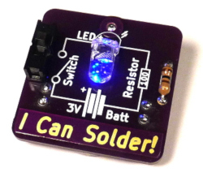

I Can Solder Kit
============

 

As simple as it gets.  An LED, resistor, switch, and battery.
Kits available at [https://www.tindie.com/products/13440/](https://www.tindie.com/products/13440/).  Contact me for a custom silkscreen!

Bill Of Materials
=================
  
- 1 ea., Perfect Purple PCB from OSH Park
- 1 ea., SWITCH SLIDE SPDT 200MA 30V, E-switch EG1903-ND, https://www.digikey.com/short/dpdz53r8
- 1 ea., R1 RES 100 OHM 1/4W 5% AXIAL, https://www.digikey.com/short/j5dv23z5
- 1 ea., D1 5mm RGB Multicolor Slow Flashing, http://a.co/d/8MpfUT4
- 1 ea., BT1 CR2032 Batt retainer, Linx BAT-HLD-001-THM, https://www.digikey.com/product-detail/en/BAT-HLD-001-THM/BAT-HLD-001-THM-ND/3044009
- 1 ea., Tie Tack & clutch, https://www.dhgate.com/product/10mm-post-nails-post-gold-silver-brass-tie/391539398.html
- 1 ea., CR2032 Battery, Panasonic CR2032, Digikey P189-ND (requires ground shipping, or buy locally).

Design Files
============
This project is designed using Open Source [KiCad](http://kicad-pcb.org/). Design files are located in the [design_files](design_files/) folder.  

Firmware
========
None

Assembly Instructions
=====================

License
=======
[Attribution-ShareAlike 3.0 United States (CC BY-SA 3.0 US)](https://creativecommons.org/licenses/by-sa/3.0/us/)

You are free to:

- Share — copy and redistribute the material in any medium or format
- Adapt — remix, transform, and build upon the material

Under the following terms:

- Attribution — You must give appropriate credit, provide a link to the license, and indicate if changes were made. You may do so in any reasonable manner, but not in any way that suggests the licensor endorses you or your use.
- ShareAlike — If you remix, transform, or build upon the material, you must distribute your contributions under the same license as the original.
