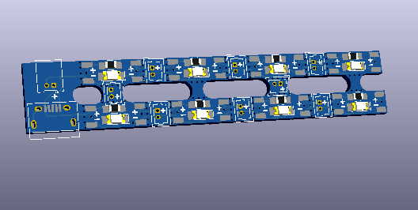

Lighting Brick for Lego

 

Bill Of Materials
----------------
  
- 1 ea., Perfect Purple PCB from OSH Park, with not so perfect layout from design_files/project.kicad_pcb file.
- 8 ea., 1206 or 0805 LED with wide viewing angle:
	- LED WL-SWTP COOL WHT 6000K 1206, Vf 3.0 https://www.digikey.com/short/zzt3mq
- 8 ea., 0805 resistor to match forward voltage of LED
	- RES SMD 100 OHM 5% 1/8W 0805, https://www.digikey.com/short/z7nv19
- 1 ea., X3, CONN RCPT MICRO USB R/A SMD, Molex 1050170001, https://www.digikey.com/short/jb2205

Connectors and jumpers as needed:
- X ea., 2POS Picoblade vertical header, https://www.digikey.com/short/p9twrj
- 1 ea., CONN HEADER R/A 2POS 1.25MM, https://www.digikey.com/short/p5r2dn
- X ea., 2POS PicoBlade housing, https://www.digikey.com/short/p4wz0d
- X ea., 12" PRE-CRIMP 1852 RED, https://www.digikey.com/short/pbfbnb
- X ea., 12" PRE-CRIMP 1852 BLACK, https://www.digikey.com/short/pbfbnd

License
----------------
[Attribution-ShareAlike 3.0 United States (CC BY-SA 3.0 US)](https://creativecommons.org/licenses/by-sa/3.0/us/)

You are free to:

- Share — copy and redistribute the material in any medium or format
- Adapt — remix, transform, and build upon the material

Under the following terms:

- Attribution — You must give appropriate credit, provide a link to the license, and indicate if changes were made. You may do so in any reasonable manner, but not in any way that suggests the licensor endorses you or your use.
- ShareAlike — If you remix, transform, or build upon the material, you must distribute your contributions under the same license as the original.