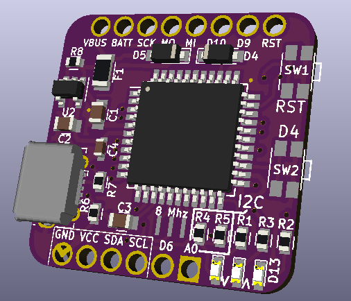

Beetje Blok 32U4

 

Based on Adafruit's [ItsyBitsy](https://learn.adafruit.com/introducting-itsy-bitsy-32u4) and SparkFun's [Pro Micro](https://www.sparkfun.com/products/12587) 3.3V/8Mhz versions.

Project page on [Hack-A-Day](https://hackaday.io/project/160638-beetje-bloks).

This is the first "dev blok" for this proof-of-concept project.  It is a KiCad mash-up of Adafruit's [ItsyBity](https://learn.adafruit.com/introducting-itsy-bitsy-32u4) and SparkFun's [Pro Micro](https://www.sparkfun.com/products/12587), jammed into Hack-A-Day's [Once Square Inch Scheme](https://hackaday.io/project/7813-the-square-inch-project) ("HADOSIS").

Bill Of Materials
----------------
  
- 1 ea., Perfect Purple PCB from OSH Park, with not so perfect kicad.pcb file.
- 1 ea., U1, ATMEGA32U4-AU, IC MCU 8BIT 32KB FLASH 44TQFP, https://www.digikey.com/short/jb25pc
- 1 ea., U2, IC REG LINEAR 3.3V 150MA SOT23-5, MIC5225-3.3YM5-TR, https://www.digikey.com/short/jb2rq8
- 3 ea,, C1-C3 10uF SMD 0805, https://www.digikey.com/short/j5d39w 
- 1 ea., C4 1uF SMD 0603, https://www.digikey.com/short/j5d397
- 3 ea., D1-D3 0603 SMD LED, https://www.digikey.com/short/j5h3h5
- 2 ea., D4, D5 DIODE SCHOTTKY 20V 1A SOD123FL, MBR120ESFT1G, https://www.digikey.com/short/jnqvz9
- 1 ea., F1 PTC 1206, Bel 0ZCJ0025AF2E, https://www.digikey.com/short/jfcbc8
- 3 ea., R1-R3 1K Ohm 0603 SMD resistor, https://www.digikey.com/short/jfcb32
- 2 ea., R4, R5 Resistor 4.7K SMD 0603, https://www.digikey.com/short/j2d05w
- 2 ea., R6, R7, 22 Ohm 5% 0603 SMD resistor, https://www.digikey.com/short/jfcbtj
- 1 ea., R8 100K ohm 0603 SMD resistor, https://www.digikey.com/short/jnqvjq
- 2 ea., SW1, Sw2 RA Tactile SPST, Pansonic EVQ-P7J01P, https://www.digikey.com/short/jfwprn
- 1 ea., X1 CONN RCPT MICRO USB R/A SMD, Molex 1050170001, https://www.digikey.com/short/jb2205
- 1 ea., Y1 Resonator 8MHZ, CSTNE8M00G55Z000R0, https://www.digikey.com/short/jb22j1

Headers:
--------

- J2, CONN HEADER FEMALE 6POS .1" GOLD, https://www.digikey.com/short/jfcnz3
- J4, CONN HEADER FEMALE 8POS .1" GOLD, https://www.digikey.com/short/jfcnzj
   or
- Stacking Arduino headers like https://www.digikey.com/short/jfcnz3
   or
- 1 ea., 64-pin header(enough for 4.5 boards) Mill-max 311-43-164-41-001000, https://www.digikey.com/short/jnqdm2
   or
- 1 ea., CONN SOCKET SIP 8POS GOLD, Mill-Max 315-47-108-41-001000, https://www.digikey.com/short/jn51q5
- 1 ea., CONN SOCKET SIP 6POS GOLD, Mill-Max 315-47-106-41-001000, https://www.digikey.com/short/jn5188

Revisions
----------------
- Revision 0.1 - Diodes and polyfuse to front.
- Revision 0.2 - I2C pullups, added SW2, enlarge holes for headers.
- Revision 0.3 - Pinout change, rerouted. NOT BACKWARD COMPATIBLE.
- Revision 0.4 - Renumbering, reordering references.
- Revision 0.5 - Enlarge holes again (for 801 series headers).
                 Switch to global beetje_footprints library.

License
----------------
[Attribution-ShareAlike 3.0 United States (CC BY-SA 3.0 US)](https://creativecommons.org/licenses/by-sa/3.0/us/)

You are free to:

- Share — copy and redistribute the material in any medium or format
- Adapt — remix, transform, and build upon the material

Under the following terms:

- Attribution — You must give appropriate credit, provide a link to the license, and indicate if changes were made. You may do so in any reasonable manner, but not in any way that suggests the licensor endorses you or your use.
- ShareAlike — If you remix, transform, or build upon the material, you must distribute your contributions under the same license as the original.