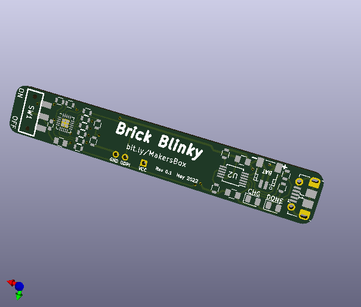

Attiny826 Lego LiPo Badge

 

Bill Of Materials
----------------

- 1 ea., Perfect Purple PCB from OSH Park from [design_files/project.kicad_pcb](project.kicad_pcb) file.
- 1 ea., Attiny826 IC MCU 8BIT 8KB FLASH 20VQFN, https://www.digikey.com/short/b9cq02np
- 3 ea., CAP CER 10uF 50V 0805,
- 1 ea., CAP CER 0.1uF 0605
- 1 ea., 3.7V LiPo (VERIFY CONNECTOR AND POLARITY).
- 1 ea., CONN RCPT MICRO USB R/A SMD, Molex 1050170001, https://www.digikey.com/short/jb2205
- 1 ea., PTC RESET FUSE 15V 100MA 0805, Bel Fuse 0ZCK0010FF2G, https://www.digikey.com/short/v24142q9
- 1 ea., JST SH CONN HEADER SMD R/A 2POS 1MM, SM02B-SRSS-TB(LF)(SN), https://www.digikey.com/short/z4vw0z
- 1 ea., CONN HOUSING SH 2POS 1MM WHITE, SHR-02V-S-B, https://www.digikey.com/short/0b2m0rpt
- 8 ea., RES SMD 100 OHM 5% 1/8W 0603
- 2 ea., RES SMD 1K OHM, 0603
- 3 ea., RES SMD 10K OHM, 0603
- 1 ea., RES SMD 39K OHM, 0603
- 1 ea., SMD SPST switch, C&K JS102011SCQN, https://www.digikey.com/short/5m7mwm1b

- LEDs: 
    - 3 ea., LED RED DIFFUSED 0603 SMD (CHG)
	- 1 ea., LED GREEN DIFFUSE 0603 SMD (DONE)
    - 7 ea., LED WHITE 0804
    

Revisions
----------------
- Revision 0.1 - Pin numbering to Konde recommended.  Divider Vcc to PIN_PC0.  JST SH header.

License
----------------
[Attribution-ShareAlike 3.0 United States (CC BY-SA 3.0 US)](https://creativecommons.org/licenses/by-sa/3.0/us/)

You are free to:

- Share — copy and redistribute the material in any medium or format
- Adapt — remix, transform, and build upon the material

Under the following terms:

- Attribution — You must give appropriate credit, provide a link to the license, and indicate if changes were made. You may do so in any reasonable manner, but not in any way that suggests the licensor endorses you or your use.
- ShareAlike — If you remix, transform, or build upon the material, you must distribute your contributions under the same license as the original.