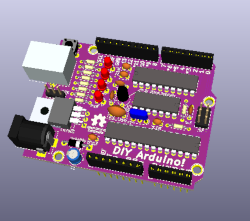

DIY Arduino clone done in KiCad.

 

Bill Of Materials
----------------
- 1 ea., PCBs from kicad.pcb file.

- 1 ea., Atmega328P-PU https://www.digikey.com/short/jn57wj
- 1 ea., L293D H-Bridge, STMicroelectronics L293D, https://www.digikey.com/short/p4fmdz
- 1 ea., IC INVERTER SCHMITT 6CH 14DIP, TI SN74HC14N, https://www.digikey.com/short/pmzjfv
- 3 ea., Hall Effect Sensor, Diodes Incorporated AH9246-P-B, https://www.digikey.com/short/p4f5dw
- 1 ea., CER RES 16.0000MHZ 30PF T/H, ECS ZTT-16.00MX, https://www.digikey.com/short/jn9pjv
- 4 ea., CER 0.1UF 25V Y5V RADIAL 2.5mm lead spacing, generic, https://www.digikey.com/short/jn9pm2
- 3 ea., CER 1UF 25V X7R RADIAL 2.5 lead spacing, generic https://www.digikey.com/short/p4fr3w
- 1 ea., MOSFET N-CH 30V 62A TO-220AB, Infineon IRLB8721PBF, https://www.digikey.com/short/p4fhcm
- 1 ea., 1N4001 Gen Purpose diode, https://www.digikey.com/short/7thwwp
- 1 ea., 3mm LED light, 
- 4 ea., 1K Ohm Resistors, 1/8W 5% generic, https://www.digikey.com/short/p4fr81
- 8 ea., 10K Resistors, 1/8W 5% generic, https://www.digikey.com/short/p4frj2 
- 2 ea., 100K ohm resistor, 1/8W 5% generic, https://www.digikey.com/short/p4frpj
- 1 ea., PTC RESET FUSE 16V 10A RADIAL, https://www.digikey.com/short/pmf2q0
- 2 ea., 1K Resistor, 1/4W 1% generic, https://www.digikey.com/short/p4frwz
- 2 ea., 10K Resistors, 1/4W 1% generic, https://www.digikey.com/short/p4fr2q
- 2 ea., 100K Resistors, 1/4W 1% generic, https://www.digikey.com/short/p4fr22

- 1 ea., 8-position sub-micro selector switch, C&K RM100772BCB, https://www.digikey.com/short/p4fm2c
- 1 ea., Selectorf switch knob, C&K 296F02000, https://www.digikey.com/short/p4f4z9
- 1 ea., SWITCH TACTILE SPST-NO 0.05A 24V, https://www.digikey.com/short/p4w42v

- 1 ea., 28 Pin socket, On Shore ED281DT, https://www.digikey.com/short/jn5tz5
- 1 ea., 16 Pin socket, ??

- 2 ea.,2POS Side Entry 3.5MM terminal, Phoenix 1984617, https://www.digikey.com/short/p45pt4
	
- 2 ea., 3POS Side Entry 3.5mm terminal, Phonenix 1984620, https://www.digikey.com/short/p4wdbq

- 1 ea., 2POS Picoblade header, https://www.digikey.com/short/p4wz0w
- 1 ea., 2POS PicoBlade housing, https://www.digikey.com/short/p4wz0d

- 1 ea., 4POS Picoblade header, https://www.digikey.com/short/p4wz0m
- 1 ea., 4POS PicoBlade housing, https://www.digikey.com/short/p4wzd1

- 1 ea., 5POS Picoblade header, https://www.digikey.com/short/p4wzdp
- 1 ea., 5POS PicoBlade housing, https://www.digikey.com/short/p4wzdb

- 1 ea., 6POS PicoBlade header, https://www.digikey.com/short/p4wz22
- 1 ea., 6POS PicoBlade housing, https://www.digikey.com/short/p4wz28

12" PRE-CRIMP 1853 RED, https://www.digikey.com/short/p4wzvf
12" PRE-CRIMP 1853 BLACK, https://www.digikey.com/short/p4wz1p
12" PRE-CRIMP 1853 BLUE, https://www.digikey.com/short/p4wz14
12" PRE-CRIMP 1853 ORANGE, https://www.digikey.com/short/p4wz1r
12" PRE-CRIMP 1853 GREEN, https://www.digikey.com/short/p4w4c4

16 AWG Silicone wire, https://www.amazon.com/BNTECHGO-Silicone-Flexible-Strands-Stranded/dp/B00TG1TRL2
18 AWG Silicone wire (7.5A, $0.40/ft), https://www.amazon.com/Silicone-Electrical-Conductor-Parallel-Flexible/dp/B07FMRDP87
16 AWG Silicone wire (12A, $0.70/ft), https://www.amazon.com/Silicone-Electrical-Conductor-Parallel-Flexible/dp/B07FMLVF84

Optional:
FTDI SERIAL TTL-232 USB CABLE, https://www.digikey.com/short/p4w47d
SPARKFUN FT231X BREAKOUT, https://www.digikey.com/short/p4w4qb

1 XT30PW Connector pairs, https://www.banggood.com/5Pairs-Amass-XT30PW-30A-Low-Temperature-Rise-Fire-Retardant-Plug-p-1075324.html

XT60 connector

Revisions
----------------
0.1 Added push button to A0.

License
----------------
[Attribution-ShareAlike 3.0 United States (CC BY-SA 3.0 US)](https://creativecommons.org/licenses/by-sa/3.0/us/)

You are free to:

- Share — copy and redistribute the material in any medium or format
- Adapt — remix, transform, and build upon the material

Under the following terms:

- Attribution — You must give appropriate credit, provide a link to the license, and indicate if changes were made. You may do so in any reasonable manner, but not in any way that suggests the licensor endorses you or your use.
- ShareAlike — If you remix, transform, or build upon the material, you must distribute your contributions under the same license as the original.