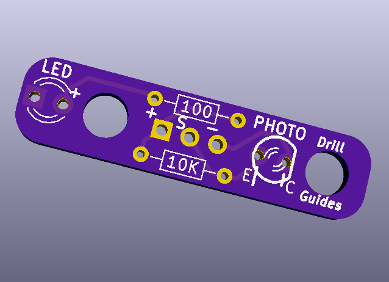

IR Chronograph for Nerf
------------

 

Two IR emitter/detector pairs to determine velocity of Nerf darts.

Bill Of Materials:
-----------------

- 2 ea., Photo Transistor, https://www.digikey.com/short/jw9ht0
- 2 ea., IR Emitter 940nm 1.2V, https://www.digikey.com/short/jw9m1r
- 2 ea., 100 ohm resistor 1/8W, https://www.digikey.com/short/q72818)
- 1 ea., Arduino Uno or Adafruit ITSYBITSY M0 EXPRESS ATSAMD21, https://www.digikey.com/short/pph95q
- heat shrink:
  - 1/16: https://www.digikey.com/short/pph5qb
  - 1/8: https://www.digikey.com/short/pph58t
- wire, 22 - 26 AWG
- 6" length of 3/4" PCV pipe

Optional:

- Perfect Purple PCBs from OSH Park
  - 2 ea., IR Chrono (one for LEDS, one for photo transistors)
  - 1 ea., switch
  - 1 ea., button  
- 1 ea., 7-segment 0.56" I2C diplay
  - blue Adafruit 881, https://www.digikey.com/short/pph9fj
  - green Adafruit 880
  - red Adafruit 878
  - yellow Adafruit 879
  - white Adafruit 1002
- 1 ea., BATT HOLDER AAA 2 CELL 6" LEADS, https://www.digikey.com/short/pph9w4
- 1 ea., 6mm SWITCH TACTILE SPST-NO 0.05A 24V, https://www.digikey.com/short/pph9np
- 1 ea., SWITCH SLIDE SPDT 200MA 30V
- 3 ea., AAA batteries

Misc:

- hot glue
- flat black paint
- drill with 5/32" or 4mm bit
- hot air gun
- 3D printed parts
- screws

Design Files
------------
The electronics were designed using Open Source [KiCad](http://kicad-pcb.org/). Design files are located in the [design_files](design_files/) folder.  You can oogle the [schematic](docs/schematic.pdf).

Firmware
--------
This project is programed using the Open Source [Arduino](https://www.arduino.cc/). I use my Open Source [AVR Programming Shield](https://www.tindie.com/products/MakersBox/yet-another-programming-shield/). The firmware is located in the [firmware](firmware/) folder.
Note: The pressure sensor is a 3V device (3.6v max).  Use a level translator with the programmer (https://www.sparkfun.com/products/11771) to avoid applying 5V to the sensor during programming!

Assembly Instructions
---------------------
TODO

License
-------
[Attribution-ShareAlike 3.0 United States (CC BY-SA 3.0 US)](https://creativecommons.org/licenses/by-sa/3.0/us/)

You are free to:

- Share — copy and redistribute the material in any medium or format
- Adapt — remix, transform, and build upon the material

Under the following terms:

- Attribution — You must give appropriate credit, provide a link to the license, and indicate if changes were made. You may do so in any reasonable manner, but not in any way that suggests the licensor endorses you or your use.
- ShareAlike — If you remix, transform, or build upon the material, you must distribute your contributions under the same license as the original.
