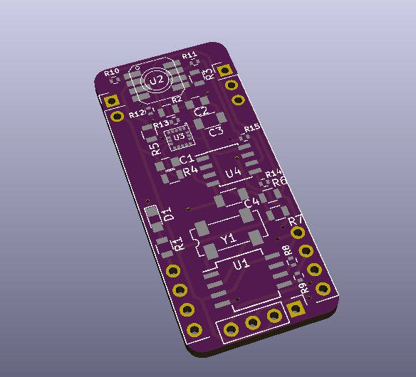

Payload V0
------------

 

Bill Of Materials
-----------------

- 1 ea., Perfect Purple PCB from OSH Park
- 1 ea., U1 IC RTC CLK/CALENDAR I2C 8-SOIC, NXP PCF8523T/1,118, https://www.digikey.com/short/j5n049
- 1 ea., U2 MINIATURE ALTIMETER MODULE, TE MS580314BA01-00, https://www.digikey.com/short/j5n0mv
- 1 ea., U3 ACCEL 2-16G I2C/SPI 16LGA, STM LIS3DHTR, https://www.digikey.com/short/j5n09v 
- 1 ea., U4 IC FRAM 256K I2C 1MHZ 8SOP, Fujitsu MB85RC256VPNF-G-JNERE1 (Narrow pkg), https://www.digikey.com/short/j5n0p7
- 1 ea., Y1 CRYSTAL 32.7680KHZ 12.5PF SMD, ECS ECS-.327-12.5-17X-TR, https://www.digikey.com/short/j5n0pn
- 3 ea., C1, 2 CAP CER 0.1UF 50V X7R 0805, https://www.digikey.com/short/j58qjp
- 1 ea., C3, 4 CAP CER 10UF 10V X5R 1206, https://www.digikey.com/short/j58q80
- 1 ea., D1 LED ORANGE CLEAR 0805 SMD, https://www.digikey.com/short/j58qzz
- 1 ea., R1 RES 330 OHM 5% 0805, https://www.digikey.com/short/j58qzr
- 4 ea., R2-5 RES 10K OHM 5% 0805, https://www.digikey.com/short/j5n0fq
- 2 ea., R6-7 RES 4K7 OHM 5% 0805, https://www.digikey.com/short/j5n0ff
- 8 ea., R8-15 RES 0 OHM 0402, https://www.digikey.com/short/j5n0nz

Design Files
------------
The electronics were designed using Open Source [KiCad](http://kicad-pcb.org/). Design files are located in the [design_files](design_files/) folder.  You can oogle the [schematic](docs/Schematic.pdf).

Firmware
--------
TODO

Assembly Instructions
---------------------
TODO

License
-------
[Attribution-ShareAlike 3.0 United States (CC BY-SA 3.0 US)](https://creativecommons.org/licenses/by-sa/3.0/us/)

You are free to:

- Share — copy and redistribute the material in any medium or format
- Adapt — remix, transform, and build upon the material

Under the following terms:

- Attribution — You must give appropriate credit, provide a link to the license, and indicate if changes were made. You may do so in any reasonable manner, but not in any way that suggests the licensor endorses you or your use.
- ShareAlike — If you remix, transform, or build upon the material, you must distribute your contributions under the same license as the original.
