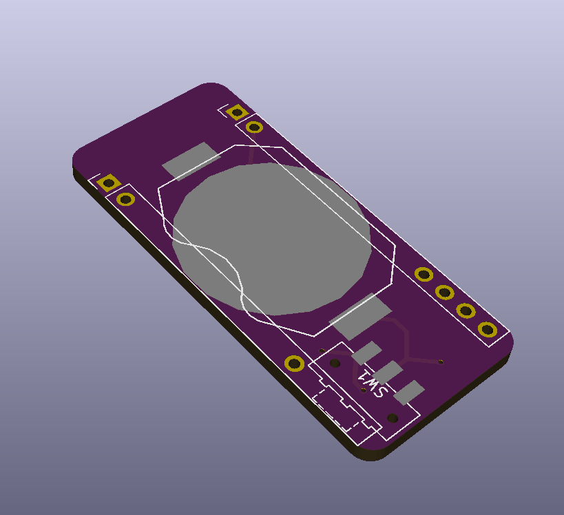

Payload Power V0
------------

 

Bill Of Materials
-----------------

- 1 ea., Perfect Purple PCB from OSH Park
- 1 ea., SW1 SWITCH REED SPST-NO 500MA 140V, Coto CT10-1530-G1, https://www.digikey.com/short/j58cd0
- 1 ea., SW2 SWITCH SLIDE SPDT, C&K JS102011SAQN, https://www.digikey.com/short/j58qp5
- 1 ea., HOLDER BATTERY 20MM COIN, Lynx BAT-HLD-001, https://www.digikey.com/short/j58q42
- 1 ea. CR2032 Battery, Panasonic CR2032, Digikey P189-ND (requires ground shipping, or buy locally).

Design Files
------------
The electronics were designed using Open Source [KiCad](http://kicad-pcb.org/). Design files are located in the [design_files](design_files/) folder.  You can oogle the [schematic](docs/Schematic.pdf).

Firmware
--------
TODO

Assembly Instructions
---------------------
TODO

License
-------
[Attribution-ShareAlike 3.0 United States (CC BY-SA 3.0 US)](https://creativecommons.org/licenses/by-sa/3.0/us/)

You are free to:

- Share — copy and redistribute the material in any medium or format
- Adapt — remix, transform, and build upon the material

Under the following terms:

- Attribution — You must give appropriate credit, provide a link to the license, and indicate if changes were made. You may do so in any reasonable manner, but not in any way that suggests the licensor endorses you or your use.
- ShareAlike — If you remix, transform, or build upon the material, you must distribute your contributions under the same license as the original.
