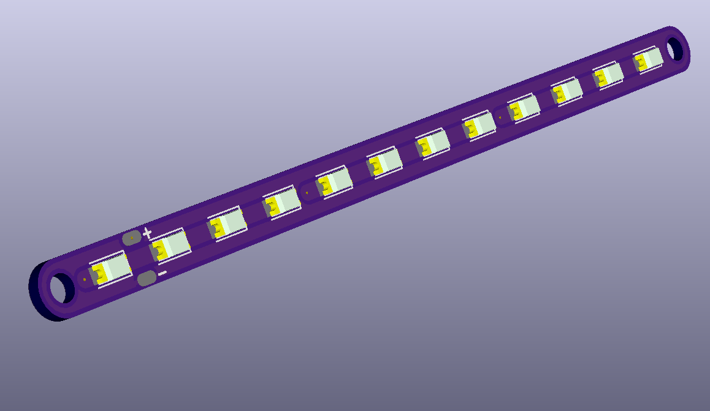

Introduction
============

 

12V LED Tail light strips

Bill Of Materials (per strip)
================= 
- 12 ea., White LED 5630 SMD, https://www.digikey.com/short/p8hn8v
- 3 ea., RES SMD 100 OHM 5% 2W 2512, https://www.digikey.com/short/p8hn8h

Design Files
============
This project is designed using Open Source [KiCad](http://kicad-pcb.org/). Design files are located in the [design_files](design_files/) folder.  You can oogle the [schematic](images/project.pdf).

Firmware
========
None

Assembly Instructions
=====================
TBD

License
=======
[Attribution-ShareAlike 3.0 United States (CC BY-SA 3.0 US)](https://creativecommons.org/licenses/by-sa/3.0/us/)

You are free to:

- Share — copy and redistribute the material in any medium or format
- Adapt — remix, transform, and build upon the material

Under the following terms:

- Attribution — You must give appropriate credit, provide a link to the license, and indicate if changes were made. You may do so in any reasonable manner, but not in any way that suggests the licensor endorses you or your use.
- ShareAlike — If you remix, transform, or build upon the material, you must distribute your contributions under the same license as the original.
