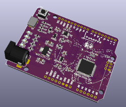

Universal Cable Tester V3

 

Bill Of Materials
----------------
  
- 1 ea., Perfect Purple PCB from OSH Park, with not so perfect layout from kicad.pcb file.
- 1 ea., U4 ATMEGA32U4-AU, IC MCU 8BIT 32KB FLASH 44TQFP, https://www.digikey.com/short/jb25pc
- 1 ea., Y1 CER RES 16.0000MHZ 15PF SMD, Murata CSTNE16M0V530000R0, https://www.digikey.com/short/8nzcmjh3
- 2 ea., C1 CAP CER 10UF 10V X5R 0805, Kemet C0805C106K8PAC7800, https://www.digikey.com/short/32v75tfv
- 23 ea., D1-D23 SMD LED GREEN 0603, Lite-On LTST-C191KGKT, https://www.digikey.com/short/ptwhtwz2
- 1 ea., F1 PTC RESET FUSE 6V 350MA 0805, Bell 0ZCK0035FF2G, https://www.digikey.com/short/b0qhczzp
- 2 ea., RV1, RV2 VARISTOR 10.8V 30A 0603, KYOCERA VCUG060050L1DP, https://www.digikey.com/short/0479hw0m
- 23 ea., R1-R23 Resistor 1K OHM SMD 0603, Stackpole RNCP0603FTD1K00, https://www.digikey.com/short/704h9hfn
- 2 ea., R24, R25 Resistor 22 OHM SMD 0603, Yageo RC0603JR-0722RL, https://www.digikey.com/short/93jrm3t2
- 1 ea., R26 Resistor 1M OHM SMD 0603 Yageo RC0603JR-071ML, https://www.digikey.com/short/z0jnrwbq
- 2 ea., SW1 SWITCH TACTILE SPST-NO 0.05A 12V, Wurth 434121025816, https://www.digikey.com/short/qbm0p0c9
- 1 ea., J1 CONN RCPT MICRO USB R/A SMD, Molex 1050170001, https://www.digikey.com/short/jb2205
- 2 ea., X1, X2 CONN EDGE DUAL FMALE 20POS, Samtek MEC8-110-02-L-D-RA1, https://www.digikey.com/short/f4rv8cjm
- 2 ea., ROUND STANDOFF M2.5 STEEL 2.7MM, Wurth 9774027151R, https://www.digikey.com/short/47zwt3m4
- 2 ea., M2.5x6 pan-head phillips screw
- 2 ea., Resistor 4K7 OHM SMD 0603

- 1 ea., 3535 RGB LED,  IN-PI33TBTPRPGPB https://www.digikey.com/short/qf2t8bqj

Card:
10K
24LC32AT-I/MC, https://www.digikey.com/short/r3f225vm
- 2 ea., M2.5 thumbscrew https://www.mcmaster.com/99607A263/
https://www.amazon.com/M2-5x6mm-Knurled-Screws-Stainless-Metric/dp/B01NBH813V

License
----------------
[Attribution-ShareAlike 3.0 United States (CC BY-SA 3.0 US)](https://creativecommons.org/licenses/by-sa/3.0/us/)

You are free to:

- Share — copy and redistribute the material in any medium or format
- Adapt — remix, transform, and build upon the material

Under the following terms:

- Attribution — You must give appropriate credit, provide a link to the license, and indicate if changes were made. You may do so in any reasonable manner, but not in any way that suggests the licensor endorses you or your use.
- ShareAlike — If you remix, transform, or build upon the material, you must distribute your contributions under the same license as the original.