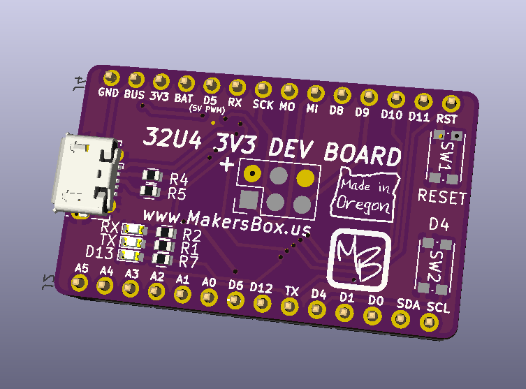

32U4
----------------

 
Intro

Bill Of Materials
----------------
  
- 1 ea., Perfect Purple PCB from OSH Park, with not so perfect layout from [design_files](design_files/) folder.
- U1, ATMEGA32U4-AU, IC MCU 8BIT 32KB FLASH 44TQFP, https://www.digikey.com/short/jb25pc
- U2, IC REG LINEAR 3.3V 150MA SOT23-5, MIC5225-3.3YM5-TR, https://www.digikey.com/short/jb2rq8
- SW1, TACTILE KMR231NG LFS, https://www.digikey.com/short/jb2r5m
- U3, IC BUFFER NON-INVERT 5.5V 5TSOP SOT-753, 74HCT1G125GV,125 https://www.digikey.com/short/jb2f3p
- Y1, Resonator 8MHZ, CSTNE8M00G55Z000R0, https://www.digikey.com/short/jb22j1
or
  Y1, CER RES 8.0000MHZ 30PF SMD, PBRC8.00HR50X000 7.40mm x 3.40mm

- D1, D4, DIODE SCHOTTKY 20V 1A SOD123FL, MBR120VLSFT3GOSCT-ND, https://www.digikey.com/short/jb22rn 
- C6, C8, C9, 10uF SMD 0805 
- C7, C14 1uF SMD 0603 
- X3, CONN RCPT MICRO USB R/A SMD, Molex 1050170001, https://www.digikey.com/short/jb2205

Design Files
----------------
This project is designed using Open Source [KiCad](http://kicad-pcb.org/). Design files are located in the [design_files](design_files/) folder.  You can oogle the [schematic](docs/project.sch.pdf).

Firmware
----------------
TBD

Assembly Instructions
----------------
TBD

License
----------------
[Attribution-ShareAlike 3.0 United States (CC BY-SA 3.0 US)](https://creativecommons.org/licenses/by-sa/3.0/us/)

You are free to:

- Share — copy and redistribute the material in any medium or format
- Adapt — remix, transform, and build upon the material

Under the following terms:

- Attribution — You must give appropriate credit, provide a link to the license, and indicate if changes were made. You may do so in any reasonable manner, but not in any way that suggests the licensor endorses you or your use.
- ShareAlike — If you remix, transform, or build upon the material, you must distribute your contributions under the same license as the original.
